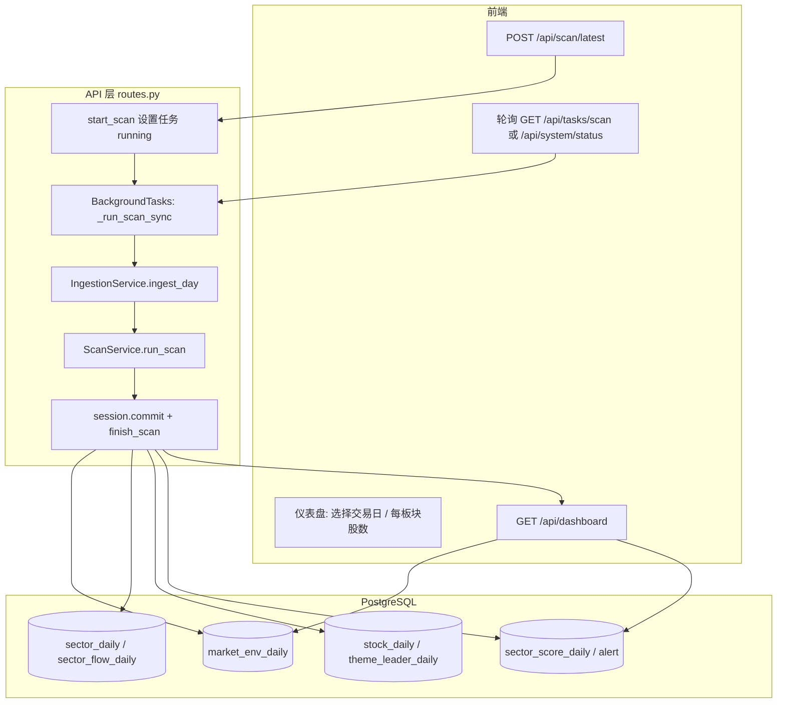
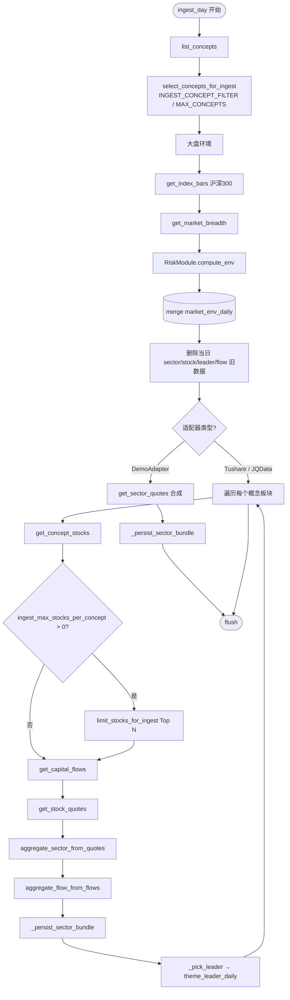
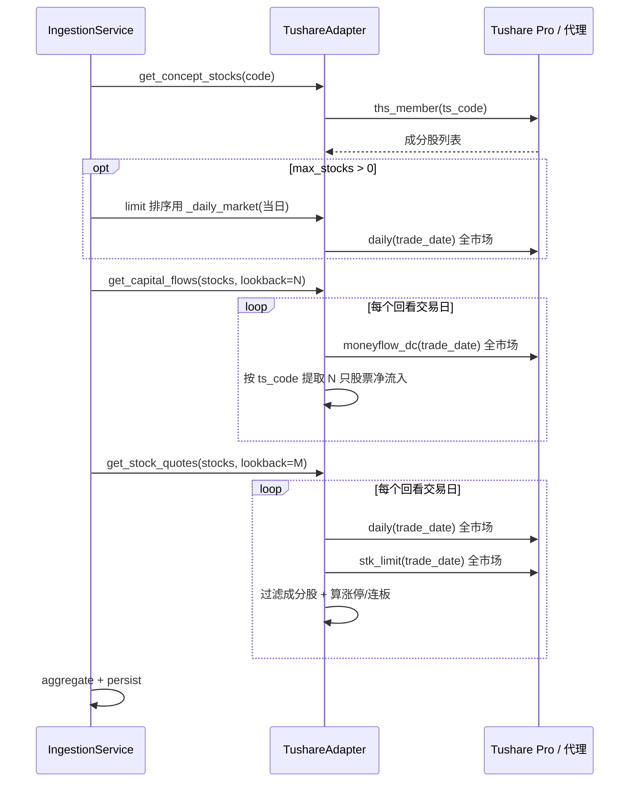
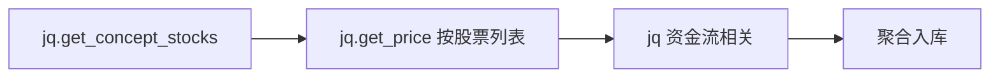
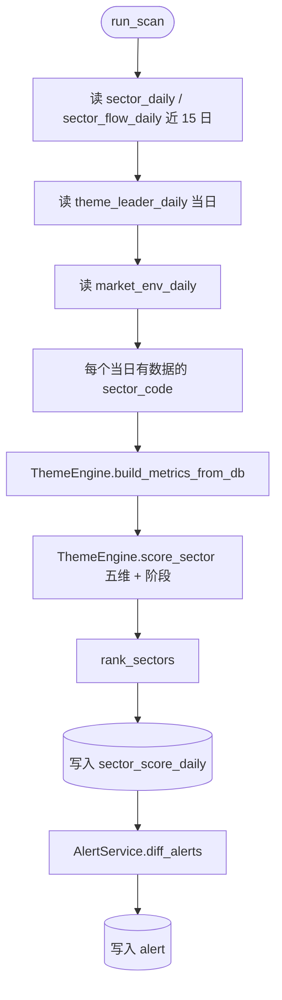

# ThemeRadar 数据获取与加工流程

本文描述从「执行收盘扫描」到仪表盘展示的完整链路，便于排查耗时与数据为空等问题。

**存储说明**：系统使用 **PostgreSQL**（`DATABASE_URL`），不是 MySQL。「入库」指将板块日行情、成分股明细、资金流、大盘环境、评分与预警等写入数据库。扫描总耗时主要取决于 **Tushare/JQ 等外部行情接口**；Postgres 写入通常只占很小比例。

相关代码：

| 模块 | 路径 |
|------|------|
| API 入口 | `backend/app/api/routes.py` |
| 入库 | `backend/app/services/ingestion.py` |
| Tushare 适配器 | `backend/app/adapters/tushare_adapter.py` |
| 聚宽适配器 | `backend/app/adapters/jqdata_adapter.py` |
| 板块聚合 | `backend/app/services/sector_aggregator.py` |
| 五维评分 | `backend/app/services/scan_service.py` + `theme_engine.py` |
| 概念/股数筛选 | `concept_select.py`、`stock_select.py`、`ingest_settings_store.py` |
| 扫描仅内存（可选） | `volatile_scan.py`、`volatile_merge.py` |

---

## 1. 总览流程图



---

## 2. 入库阶段 `IngestionService.ingest_day`



### 2.1 `_persist_sector_bundle` 写入表

| 表 | 内容 |
|----|------|
| `sector_daily` | 板块涨跌幅、涨停数、上涨家数、炸板率等 |
| `sector_flow_daily` | 主力净流入合计、连续流入天数 |
| `stock_daily` | 成分股日线特征（涨停、大阳、连板等） |
| `theme_leader_daily` | 板块龙头 1 只（连板优先，否则成交额最大） |

---

## 3. Tushare 数据获取（实盘常用）

**特点**：`daily` / `moneyflow_dc` / `stk_limit` 按**交易日拉全市场**（约 5000 行），再在内存中用 `ts_code.isin(成分股)` 过滤。



### 3.1 主要函数与 Tushare 接口

| 函数 | Tushare 接口 | 说明 |
|------|--------------|------|
| `list_concepts` | `ths_index` | 同花顺概念列表（缓存） |
| `get_concept_stocks` | `ths_member` | 概念成分股 |
| `get_index_bars` | `index_daily` | 沪深300等指数 |
| `get_market_breadth` | `daily` + `limit_list_d` | 涨跌家数、涨停家数 |
| `_daily_market` | `daily` | 全市场日线（按日缓存） |
| `_moneyflow_market` | `moneyflow_dc` | 全市场资金流（按日缓存） |
| `_limit_table` | `stk_limit` | 涨跌停价（按日缓存） |
| `get_capital_flows` | 复用 `_moneyflow_market` | lookback 日 × 全市场拉取 |
| `get_stock_quotes` | 复用 `_daily_market` + `_limit_table` | lookback 日 × 全市场拉取 |

### 3.2 耗时主要来自（CPO 单板块示例）

默认 `ingest_flow_lookback_days=3`、`ingest_price_lookback_days=8` 时，约：

- `moneyflow_dc` × **3** 次（每次全市场）
- `daily` × **约 7～8** 个交易日
- `stk_limit` × **约 7～8** 个交易日  
- 另加 `trade_cal`、`ths_member`、大盘 `index_daily` / `limit_list_d` 等

每次 HTTP 受 `tushare_rate_limiter` 限速（默认约 170 次/分钟）。**将成分股从 180 减到 20 不会明显减少上述全市场接口次数**，主要减少入库行数与内存循环。

---

## 4. 聚宽 JQData 数据获取



**特点**：`get_price(stock_codes, ...)` 按**股票列表**拉取，成分股越少通常越快。

---

## 5. 评分阶段 `ScanService.run_scan`

入库完成后执行（**不再调用外部行情 API**），只读数据库：



五维权重：持续性 25% / 资金 30% / 广度 25% / 龙头 15% / 相对强度 5%（见 `theme_engine.py`）。

---

## 6. 任务进度 `scan_task` 说明

| 字段 | 含义 |
|------|------|
| `total` | 当前为**概念板块数**（非股票数） |
| `progress` | 已完成的概念数 |
| `message` | 如「正在处理第 1/1 个概念（共封装光学(CPO)）…」 |

单概念（如仅 CPO）时，在整个 `get_capital_flows` + `get_stock_quotes` 期间 `progress` 可能长期为 **0**，完成后才变为 1。详见日志前缀 `[数据]` 的分段耗时。

---

## 7. 配置项速查

| 环境变量 / 设置 | 作用 |
|-----------------|------|
| `DATA_SOURCE` / 仪表盘切换 | `tushare` / `jqdata` / `demo` |
| `INGEST_CONCEPT_FILTER` | 仅入库名称含关键词的概念（如 `CPO`） |
| `INGEST_MAX_CONCEPTS` | 最多扫描几个概念 |
| `INGEST_MAX_STOCKS_PER_CONCEPT` | 每板块最多分析几只成分股（0=全部） |
| `ingest_settings.override.json` | 仪表盘覆盖「每板块分析股数」 |
| `ingest_flow_lookback_days` | 资金流回看交易日数 |
| `ingest_price_lookback_days` | 价格/连板回看交易日数 |
| `SCAN_VOLATILE_STORAGE=true` | **易失模式**：当日扫描结果不落库 Postgres，仅存进程内存；`GET /dashboard` 在日期匹配时优先读内存快照；历史 15 日回看仍读数据库。API 多 worker / 重启后快照丢失。不改变 Tushare 拉全市场行情的次数，**无法显著缩短**「拉数」阶段耗时。 |

---

## 8. 日志排查

扫描时在 API 容器查看：

```bash
docker compose logs api -f | grep '\[数据\]'
```

典型顺序：

1. `[数据] ingest_day 开始`
2. `[数据] Tushare ths_member ...`
3. `[数据] get_capital_flows ... 耗时=...`
4. `[数据] Tushare daily/moneyflow_dc ... 耗时=... rows=5000`
5. `[数据] get_stock_quotes ... 耗时=...`
6. `[数据] ScanService.run_scan ... 耗时=...`
