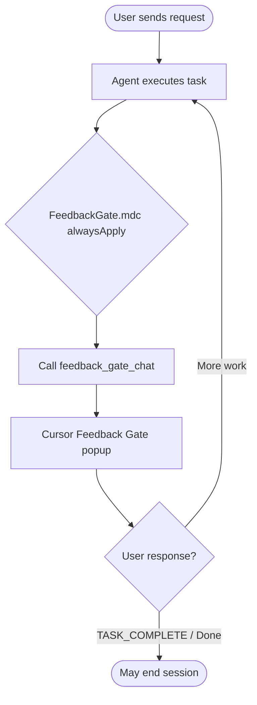
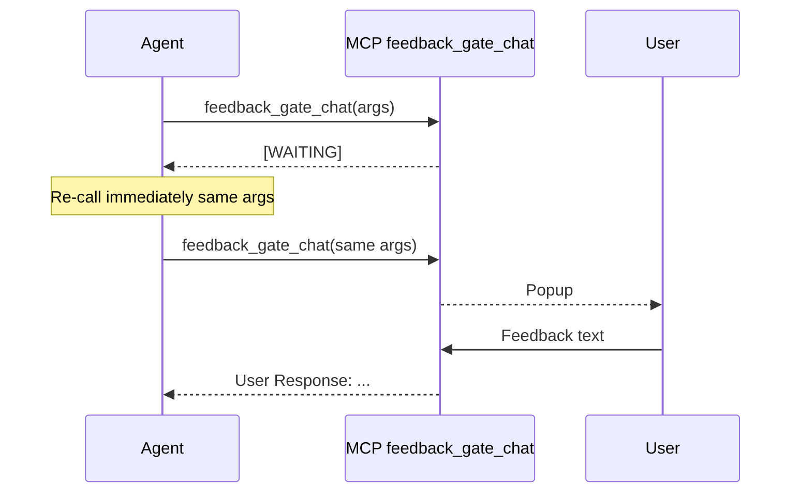
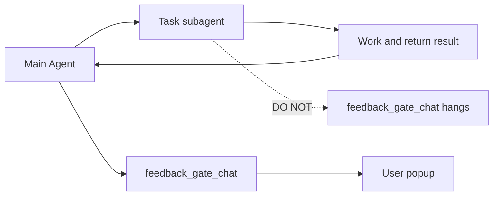
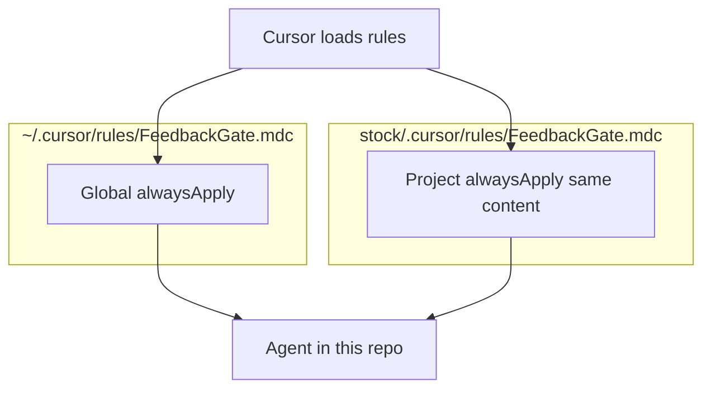
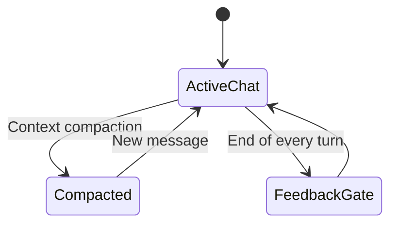

# Feedback Gate 协议指南

> **Overview (EN):** Project-level Cursor rule that requires the Agent to open an MCP feedback popup after each task slice and loop until you send an explicit completion signal (`TASK_COMPLETE`, `Done`, etc.).

| 项 | 路径 |
|----|------|
| 项目规则 | `.cursor/rules/FeedbackGate.mdc` |
| 全局规则（内容相同） | `~/.cursor/rules/FeedbackGate.mdc` |
| MCP Server | `user-feedback-gate` |
| MCP Tool | `feedback_gate_chat` |
| HTML 版（同内容） | [feedback-gate-guide.html](./feedback-gate-guide.html) |

---

## 1. 概述 / Overview

**中文：** `alwaysApply: true` 的 Cursor 规则，约束 AI 每轮任务结束后调用 `feedback_gate_chat` 弹窗收集反馈，直到你明确结束。

**English:** An always-on rule; the Agent must not end a turn without calling the feedback MCP tool and waiting for your completion signal.

**边界 / Scope:**

- ✅ 影响：Cursor 内 Agent 的对话结束方式
- ❌ 不影响：扫盘、回测、Tushare、Docker 等业务运行时

**为何有项目内副本 / Why a repo copy:**

与全局规则内容一致；复制到本仓库后，即使全局规则未加载，在本项目对话中仍会生效。

---

## 2. 主反馈循环 / Main loop



| 步骤 | 中文 | English |
|------|------|---------|
| 1 | 执行用户请求 | Execute the user request |
| 2 | 调用 `feedback_gate_chat` 弹窗 | Call `feedback_gate_chat` |
| 3 | 根据反馈继续修改 | Apply feedback and continue |
| 4 | 直到 `TASK_COMPLETE` / `Done` | Loop until explicit completion |

---

## 3. `[WAITING]` 重试 / Retry on WAITING

**中文：** 若工具返回 `[WAITING]`，Agent 必须**立即用相同** `message` / `title` / `context` 再次调用，直到回复中出现 `User Response:`。

**English:** `[WAITING]` means still waiting — re-call immediately with the same arguments until `User Response:` appears.



---

## 4. 子代理边界 / Subagent boundary

**中文：** 通过 Task 启动的子代理**不得**调用 `feedback_gate_chat`（会卡住）；主对话在汇总子代理结果后再弹窗。

**English:** Subagents must NOT call the gate; only the main Agent opens the popup after aggregating subagent results.



---

## 5. 规则加载 / Rule loading



---

## 6. 上下文压缩后 / After context compaction

**中文：** 长对话被压缩后，**每轮回复结束前仍须**调用 Gate；不得因历史摘要中的失败/超时而跳过。

**English:** After compaction, still call the gate every turn; do not skip because summarized history shows errors.



---

## 7. MCP 工具参数 / Tool parameters

| 参数 | 中文 | English |
|------|------|---------|
| `message` | 弹窗主文案 | Main text in popup |
| `title` | 窗口标题（默认 Feedback Gate） | Window title |
| `context` | 技术摘要（可选） | Optional technical summary |
| `urgent` | 是否紧急（可选） | Urgent flag (optional) |

### 约束 / Constraints

- 每轮回复结束前必须调用 · Mandatory every assistant turn
- MCP 不可用时应提示检查 `user-feedback-gate` · Report if server is down
- 启动 Web 服务或长期进程前需用户确认 · Ask before long-running servers

---

## 8. 不完善之处 / Known gaps

| 类别 | 问题（中文） | Gap (English) | 优先级 |
|------|----------------|---------------|--------|
| 机制 | 无 Hook/CI，靠模型自觉，易漏调 | Soft enforcement only | 高 |
| 机制 | 子代理与主代理责任未写进规则正文 | Subagent policy not in rule file | 高 |
| 机制 | `[WAITING]` 无超时/最大重试 | No timeout/retry policy | 高 |
| 机制 | 完成信号非结构化 | Informal DONE vs CONTINUE | 中 |
| 机制 | MCP 单点，无备用通道 | Single point of failure | 中 |
| 体验 | 每轮必弹窗，小问答摩擦大 | High friction for trivial Q&A | 中 |
| 体验 | 弹窗与聊天双通道可能分裂 | Popup vs chat desync | 中 |
| 文档 | `description` 为空 | Empty rule frontmatter | 低 |
| 工程 | 无 README/hooks 绑定流程 | Not integrated in repo workflow | 低 |
| 工程 | 全局+项目双份规则无去重说明 | Duplicate rules, unclear precedence | 中 |

---

## 9. 改进方向 / Improvements

| 优先级 | 动作 | Note |
|--------|------|------|
| 低 | 补全 `description`（中英文） | Better rule list visibility |
| 低 | 链入 `README.md` / 新增 `AGENTS.md` | Team onboarding |
| 中 | 结构化完成信号 `DONE` / `CONTINUE` / `RUN_SERVER_OK` | Machine-readable completion |
| 中 | Cursor Hook：漏调时提醒 | Harder-to-miss gate |
| 高 | 规则正文明确：仅主代理调 Gate | Fix subagent hang |

---

## 10. 相关文件速查

```
stock/
├── .cursor/rules/FeedbackGate.mdc    # 项目规则（alwaysApply）
├── docs/feedback-gate-guide.md       # 本文档
├── docs/feedback-gate-guide.html     # HTML 版（含样式）
└── ~/.cursor/projects/.../mcps/user-feedback-gate/tools/feedback_gate_chat.json
```

---

*Last updated: 2026-05-21 · stock workspace*
